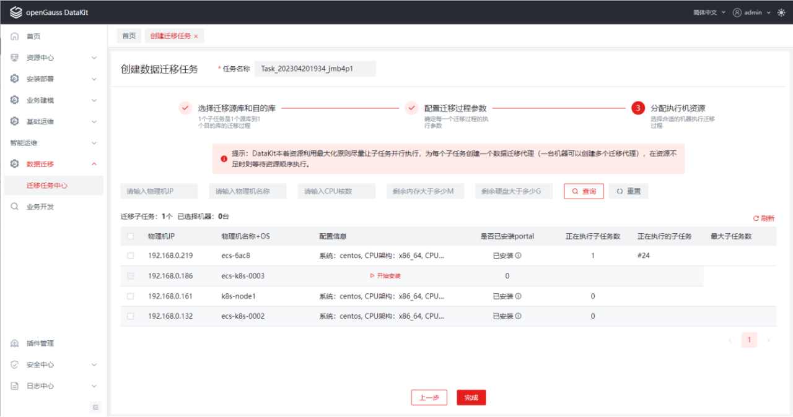

## 迁移方案说明

### 迁移概述

### 迁移流程

### 迁移评估

### 应用适配

### 数据迁移

#### 迁移模式

- 全量迁移

将MySQL端已有数据和对象迁移至openGauss端。

- 全量校验

对源端和目的端全量迁移的数据进行校验。

- 增量迁移

将MySQL端产生的增量数据迁移至openGauss端。

- 增量校验

对源端和目的端增量迁移的数据进行校验。

- 反向迁移

将openGauss端产生的增量数据迁移至MySQL端。

- 离线模式

迁移工具集会执行包括全量迁移和全量校验的迁移计划。

- 在线模式

迁移工具集会执行包括全量迁移、全量校验、增量迁移、增量校验和反向迁移在内的迁移计划。迁移工具集在全量迁移执行结束后会持续处于增量迁移状态，如果用户选择停止增量并启动反向，那么迁移工具集将结束增量迁移状态，进入反向迁移状态。

#### 前置要求

- 执行迁移任务的服务器应具备一定的性能和配置，以保证迁移过程的顺利执行。

- 为保证数据的顺利迁移，添加MySQL数据源时，请添加具备数据库读写权限的用户；添加openGauss数据源时，请添加具备SYSADMIN权限和逻辑复制权限的用户。

- 迁移过程中，请勿关闭源数据库或目标数据库。

#### 约束限制

##### MySQL相关约束

- MySQL需要5.7及以上的版本。

- MySQL参数设置要求为：

  ```
  log_bin=ON, binlog_format=ROW, binlog_row_image=FULL, gtid_mode = ON。
  若gtid_mode=off，会降低在线迁移的性能。
  ```

-  Kafka中以AVRO格式存储数据，AVRO字段名称[命名规则](https://gitee.com/link?target=https%3A%2F%2Favro.apache.org%2Fdocs%2F1.11.1%2Fspecification%2F%23names)为：以[A-Za-z_]开头；随后仅包含[A-Za-z0-9_]。因此，对于MySQL中的标识符命名，包括表名、列名等，需满足上述命名规范，否则增量迁移会报错。

##### openGauss相关约束

- openGauss需要3.0.0及以上版本。

- openGauss参数设置要求为：

  ```
  wal_level = logical
  ```

- 反向迁移依赖于openGauss的逻辑复制，仅限能进行逻辑复制的用户进行操作。

- 需要调整pg_hba.conf以允许复制（这里的值取决于实际的网络配置以及用于连接的用户）：

  ```
  host   replication   repuser   0.0.0.0/0   sha256
  ```

##### 其他约束

- JDK 版本要求JDK11+。

- 增量迁移支持DDL和DML操作，对于不兼容的DDL，迁移时会报错处理（openGauss在完善对DDL的兼容性）。

- 反向迁移支持DML操作，不支持DDL操作。

#### 迁移实施

在准生产环境验证数据迁移的正确性、可靠性。

- 添加数据库实例和迁移工具部署机器

用户需要在“资源中心—实例管理”界面添加MySQL实例和openGauss实例，在“资源中心—设备管理”界面添加迁移工具部署机器。

- 创建迁移任务

在“数据迁移—迁移任务中心”界面创建迁移任务，指定迁移源端和目的端数据库、迁移模式（离线/在线）、配置自定义迁移参数，分配迁移工具部署机器并安装迁移工具集。

- 启动迁移任务

在迁移任务中心启动迁移任务，开始数据迁移。



#### 使用指南

详细流程请参见迁移[使用指南](https://gitee.com/opengauss/openGauss-workbench/blob/master/data-migration/doc/DataKit%20Product%20Manual%20-%20Data%20Migration%20.md)

### 试运行

### 生产割接

在准生产环境确定以上前置条件和相关约束已全部满足。

- 在线模式下，停止增量迁移。

  在任务详情页面点击“停止增量”按钮，迁移工具集发送增量迁移结束时的lsn给反向迁移工具。

- 在线模式下，启动反向迁移。

  在任务详情页面点击“启动反向”按钮，反向迁移工具接收lsn，从该lsn开始开始监控业务运行状态，同步增量数据的增、删、改操作到旧生产环境，实现不重复、不遗漏的数据备份。

### 运维

